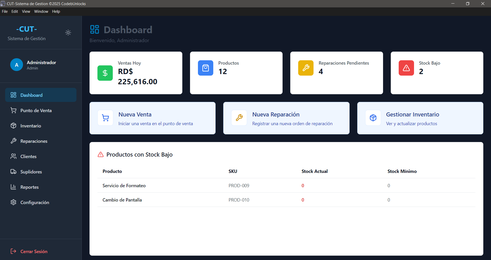
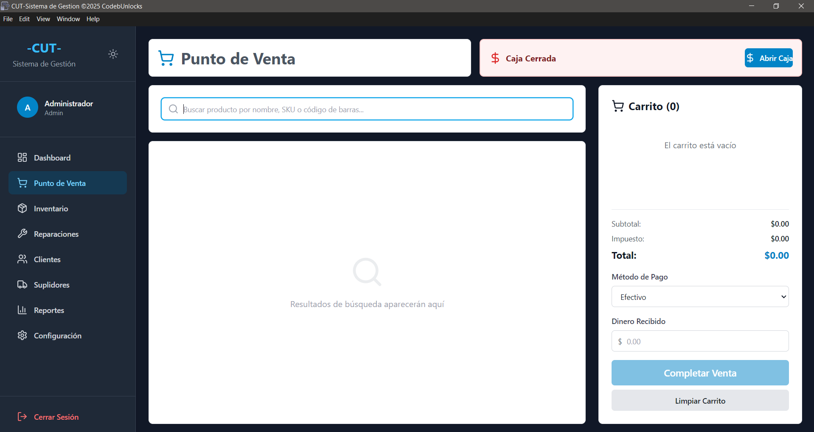
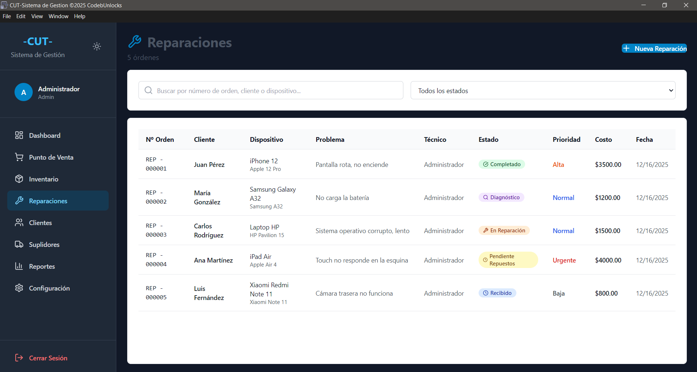
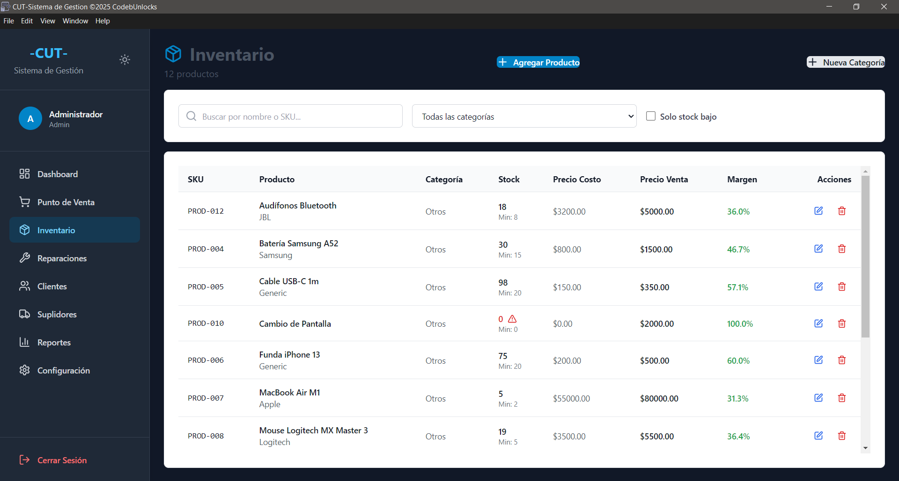
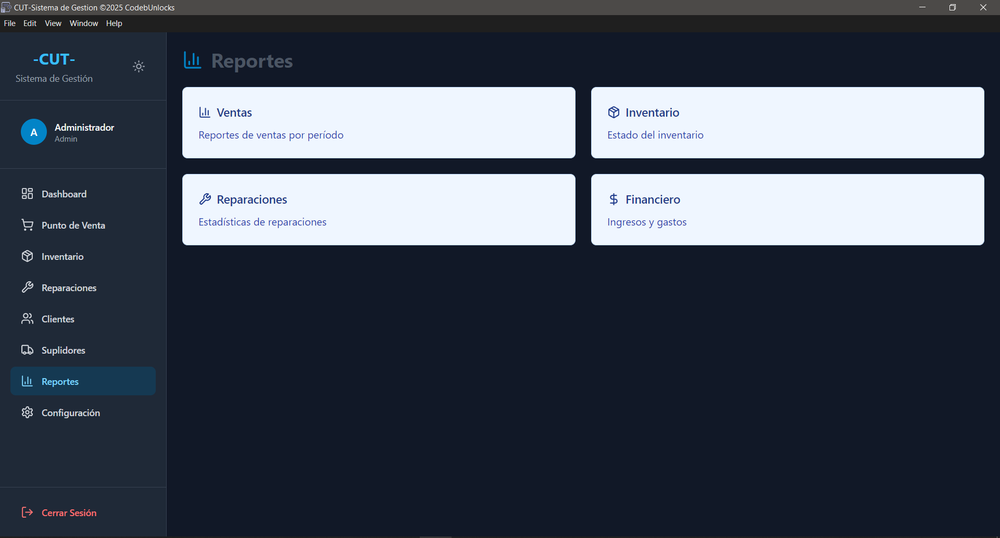

# CUT-POS-Updates
Actualizaciones para [CUT] Sistema de Gestion de Punto de Ventas y Taller de Reparaciones.

# Version 1.1.8
Corrección de error: "Entrada incompleta" al activar la licencia
Este plan corrige el error de "entrada incompleta" que se produce al intentar activar el software. El error se debe a una sentencia SQL incorrecta en el controlador IPC license:activate.

# CUT-POS and Repair Shop

**CUT-POS and Repair Shop** es un sistema de gestión robusto diseñado para negocios que combinan la venta al detalle con un taller de servicios técnicos o reparaciones. Construido con Electron y React, ofrece una solución rápida, local y confiable para las operaciones diarias.

## 📸 Vistas del Sistema

| Punto de Venta | Gestión de Reparaciones |
| :---: | :---: |
|  |  |

| Inventario | Reportes y Dashboard |
| :---: | :---: |
|  |  |

## 🚀 Características Principales

### 🛒 Punto de Venta (POS)
- **Búsqueda Rápida**: Encuentra productos por nombre, SKU o código de barras.
- **Gestión de Carrito**: Cálculos de impuestos y totales en tiempo real con estado persistente.
- **Múltiples Métodos de Pago**: Efectivo, Tarjeta, Transferencia y Crédito (Cuentas por Cobrar).
- **Generación de Facturas**: Numeración automática de facturas y cumplimiento de impresión de recibos profesionales.
- **Notificaciones de Éxito**: Confirmación visual tras cada transacción exitosa.

### 🔧 Gestión de Taller de Reparaciones
- **Seguimiento de Órdenes**: Ciclo de vida completo para reparaciones (Recibido → En Proceso → Completado → Entregado).
- **Detalles del Servicio**: Seguimiento de técnicos, información del dispositivo, fallas específicas y costos estimados vs. reales.
- **Tickets de Reparación**: Impresión de tickets de doble copia (Cliente e Interno) para nuevas órdenes.
- **Historial**: Consulta el historial completo de reparaciones de cualquier cliente.

### 📦 Inventario y Productos
- **Stock en Tiempo Real**: Deducción automática de stock en ventas e incrementos en compras.
- **Gestión de Categorías**: Organiza productos para mejores reportes.
- **Alertas de Bajo Stock**: Indicadores visuales y reportes dedicados para productos que necesitan reposición.
- **Soporte para Servicios**: Compatibilidad con ítems tipo "Servicio" que no requieren inventario físico.

### 💵 Caja y Finanzas
- **Sesiones Diarias**: Seguimiento de balance de apertura y cierre con conteo físico de denominaciones.
- **Movimientos de Efectivo**: Registro de ingresos (depósitos) y egresos (retiros) directamente a la sesión.
- **Caja Chica**: Gestión integrada de caja chica para gastos menores.
- **Resumen Financiero**: Resumen de ventas en tiempo real y cálculo de balance esperado.

### 👥 Gestión de Clientes y Suplidores
- **Perfiles de Clientes**: Almacenamiento de información de contacto, balance de deudas e historial de transacciones.
- **Seguimiento de Suplidores**: Gestión de historial de compras y pagos pendientes.

### 📊 Reportes
- **Reportes de Ventas**: Resúmenes diarios y reportes detallados por ítem.
- **Análisis Financiero**: Seguimiento de ingresos, impuestos y métodos de pago en rangos de fechas personalizados.

---

## 🛠 Tecnologías Utilizadas

- **Núcleo**: Electron (v33+)
- **Frontend**: React (v18.3) con Vite
- **Estilos**: Tailwind CSS y Lucide React
- **Gestión de Estado**: Zustand (Auth, Carrito, Tema)
- **Captura de Datos**: TanStack Query (React Query)
- **Base de Datos**: SQLite (vía `better-sqlite3`)
- **Utilidades de Backend**: BCrypt (Encriptación de contraseñas), Date-fns (Formateo de fechas)

---

## 🔐 Acceso Basado en Roles

El sistema soporta múltiples roles de usuario con diferentes permisos:
- **Admin**: Acceso total a todas las funciones, incluyendo configuración del sistema y registros.
- **Manager**: Acceso a reportes, inventario y ventas.
- **Cajero**: Acceso optimizado para operaciones de POS y caja.
- **Técnico**: Acceso enfocado en el módulo de Reparaciones.

---

## 📄 Licencia
Este proyecto está bajo la Licencia MIT.

Desarrollado con ❤️ por **Eduardo Britto**.
