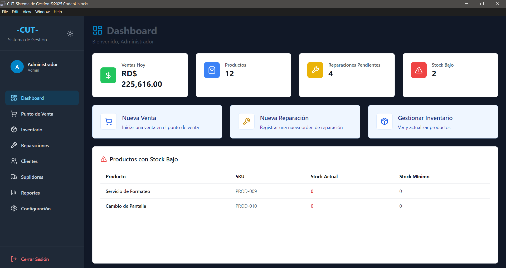
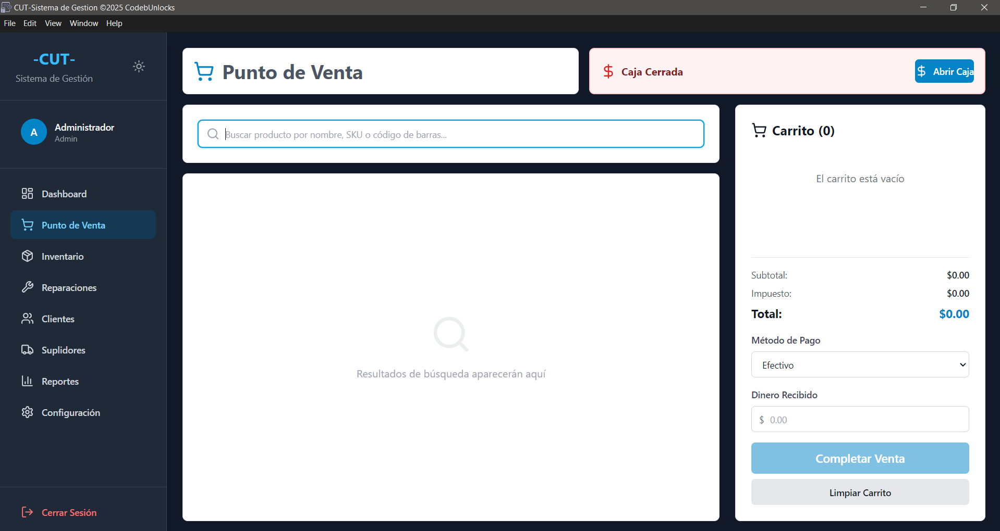
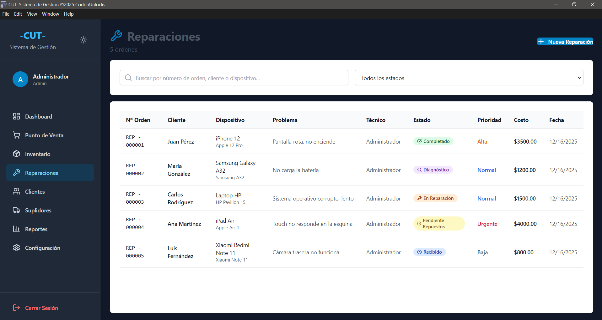
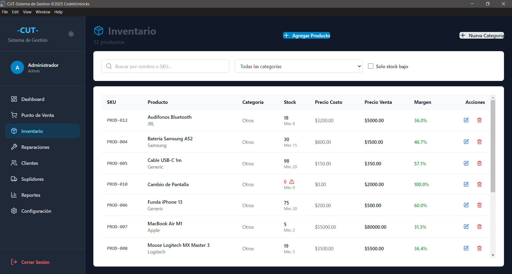
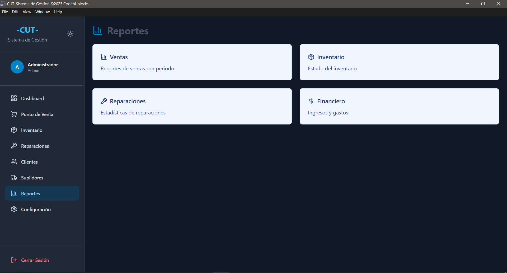

# CUT-POS-Updates
Actualizaciones para [CUT] Sistema de Gestion de Punto de Ventas y Taller de Reparaciones.

# Actualización del Sistema - Version 1.5.0 - 23/09/2026

## 🔐 Nueva ventana de acceso

- **Todo en un solo lugar:** Entrar, Crear cuenta y Vincular ahora viven en la misma ventana con pestañas. Ya no saltas de una pantalla a otra.
- **Crear cuenta:** registra tu negocio (empresa, email, usuario y clave) y la cuenta queda pendiente de activación manual. Te avisamos por email cuando esté lista.
- **Vincular:** ata tu instalación a la cuenta que creaste en Crear cuenta. Si aún no tienes cuenta, créala primero ahí. Conservas todos tus datos locales. La pestaña se desactiva sola cuando ya vinculaste.
- **Al vincular, entras con tu usuario nuevo:** la ventana de acceso lo deja escrito, solo digitas tu clave.
- **Modo Demo:** entra con `demo` / `demo123` y prueba el sistema completo. Al salir, todo lo que registres se borra solo. Nada toca tu base de datos real.

## 📶 Estado del servidor y suscripción

- **Píldora Servidor Activo:** el menú lateral muestra si hay conexión con el servidor, verificado automáticamente al abrir la app.
- **Botón de plan:** debajo verás tu plan y los días restantes (ej. `Plan basico · 30 día(s)`). En demo muestra una suscripción de ejemplo que nunca vence.
- **Modal de suscripción:** tócalo y verás estado, vencimiento, última verificación y botón para reintentar.
- **Sin cobro automático:** la renovación se gestiona manualmente con soporte.
- **Sin vínculo no entras:** la app pide vincular antes de dejarte pasar (solo demo entra sin vínculo). Sin internet, sigues trabajando offline.

## 🧪 Datos de prueba reconstruidos

- **Cargar Datos de Prueba:** ahora llena productos con series, clientes, suplidores, reparaciones en todos los estados, ventas al contado y a crédito, compras, caja chica y gastos generales. Sirve para probar cada función.
- **Limpiar Datos de Prueba:** borra todo lo de prueba sin tocar tus datos reales.

## 🛠️ Mejoras internas

- La app ya no se bloquea si el actualizador falla al arrancar.
- Marca unificada a **CUTPOS** en ventanas, títulos y documentos.
- Mensajes de error claros cuando el servidor no responde.

# Actualización del Sistema - Version 1.4.6 - 08/01/2026

### 🛠️ Mejoras en Reparaciones y Facturación
- **Validación de Pago:** Ahora el sistema no permite confirmar la entrega de una reparación en efectivo si el monto recibido es menor al total pendiente. Esto evita errores al momento de cobrar.
- **Recibos más Claros:** Los tickets de reparación ahora muestran un desglose detallado que incluye:
  - Subtotal de piezas y mano de obra.
  - Impuestos (ITBIS) y Descuentos aplicados.
  - Abonos realizados anteriormente.
  - Monto pagado hoy y el cambio devuelto (en efectivo).
- **Contacto del Cliente:** Se ha incluido el número de teléfono del cliente en todos los recibos, tanto en ventas como en reparaciones, para facilitar el contacto.

# Actualización del Sistema - Version 1.4.0 - 30/12/2025

Actualizacion silenciosa, cambios menores...

# Actualización del Sistema - Version 1.3.9 - 30/12/2025

Reparado error "UNIQUE constraint error in Order Numbers"

# Actualización del Sistema - Version 1.3.8 - 29/12/2025

Esta actualización introduce mejoras menores en la gestión de reparaciones y el control de caja, enfocándose en la consistencia de datos y la transparencia financiera.

# Actualización del Sistema - Version 1.3.7 - 29/12/2025

Esta actualización introduce mejoras significativas en la gestión de reparaciones y el control de caja, enfocándose en la consistencia de datos y la transparencia financiera.

### 🧾 Control de Caja Detallado (Nuevo)
- **Historial de Movimientos**: Ahora el modal de "Movimiento de Caja" incluye una lista detallada de todos los depósitos y retiros realizados durante el turno.
- **Impresión de Comprobantes**: Cada movimiento de caja (entrada o salida) ahora puede imprimirse individualmente como un ticket térmico, facilitando la firma y el archivo físico.
- **Transparencia**: Los registros incluyen la hora exacta, el motivo detallado y el usuario que realizó el movimiento.

### 🔧 Mejoras en el Formulario de Reparación
- **Selector de Marcas**: Se reemplazó el campo de texto libre por un selector de marcas pre-registradas, asegurando que los reportes por marca sean precisos.
- **Acceso Rápido**: Ahora puede agregar una nueva marca directamente desde el formulario de reparación sin perder el progreso de la orden.
- **Selección Automática**: Al crear una nueva marca, el sistema la selecciona automáticamente para el equipo que está registrando.

### 📊 Historial de Compras (Mejorado)
- **Visualización de Pagos**: El historial de compras ahora permite ver el detalle de los abonos realizados bajo la nueva lógica de pagos parciales.
- **Sincronización con Caja**: Todos los pagos realizados a suplidores se reflejan correctamente en el balance de caja y reportes diarios.

---
*Nota: Estas mejoras han sido diseñadas para reducir errores humanos y proporcionar un rastro de auditoría claro para cada centavo que entra o sale del negocio.*

# Actualización del Sistema - Version 1.3.6 - 29/12/2025

## 🚀 Resumen de Novedades

### 📦 Compras y Pagos a Suplidores
- **Historial Detallado**: Ahora puedes ver exactamente cuánto has pagado y cuánto debes de cada compra directamente en la lista.
- **Registro de Abonos**: Se agregó un botón para registrar pagos parciales fácilmente desde el historial.
- **Seguridad en Datos**: Mejoramos la precisión del historial para que solo veas los pagos que corresponden a cada compra específica.

### 🛠️ Formulario de Reparaciones
- **Selector de Marcas**: Ya no tienes que escribir el nombre de la marca cada vez. Ahora puedes elegirla de una lista.
- **Agregar Marcas Rápido**: Incluimos un botón "+" para que registres marcas nuevas al instante sin cerrar lo que estás haciendo.
- **Diseño Mejorado**: Los campos ahora están mejor organizados y alineados para que el formulario sea más fácil de llenar.

# Actualización del Sistema - Version 1.3.5 - 29/12/2025

## 🚀 Reinvención del Módulo de Compras y Suplidores

Hemos rediseñado por completo la gestión de compras para que sea más rápida e intuitiva, unificando todo en una sola pantalla.

### ✨ Novedades Principales

1.  **Vista Unificada de "Compras y Suplidores"**
    - Ahora tienes dos pestañas principales: **Suplidores** y **Historial**.
    - Puedes cambiar entre gestionar tus suplidores y ver todas tus compras sin salir de la pantalla.

2.  **Panel de Control Inteligente**
    - **Todo en un solo lugar:** El buscador, las pestañas y los botones de acción ahora viven en una tarjeta fija en la parte superior.
    - **Buscador Global:** La misma barra de búsqueda te sirve para encontrar suplidores o buscar compras específicas por número o nombre.

3.  **Historial de Compras Mejorado**
    - Nueva pestaña dedicada para ver **todas** las compras realizadas.
    - **Filtros Rápidos:** Botones de "Todos", "Pagados" y "Pendientes" integrados directamente en el panel principal para filtrar al instante.
    - Detalles expandibles para ver los productos de cada compra sin perder el contexto.

4.  **Registro de Compras Simplificado**
    - El botón **"Registrar Compra"** está siempre visible y accesible.
    - Se solucionaron problemas donde a veces el número de la compra podía duplicarse.

### 🛠️ Otras Mejoras
- Interfaz más limpia y consistente con el Panel de Control (Dashboard).
- Mejor organización del espacio en pantalla.

# Actualización del Sistema - Version 1.3.4 - 28/12/2025

## 🚀 Resumen de Novedades

Hemos realizado mejoras importantes en el **Registro de Compras** y la gestión del inventario para que tu trabajo sea más rápido y sin errores.

### 🛒 Registro de Compras Mejorado
*   **Gestión Inteligente de Pagos:**
    *   Ahora, al seleccionar **"Al Contado"**, el sistema marca automáticamente la compra como **Pagada** y completa el monto total. ¡Un clic menos!
    *   Al seleccionar **"A Crédito"**, se marca como **Pendiente** y te permite definir cuánto abonaste inicialmente.
*   **Inventario al Instante:** No importa si la compra es a crédito o al contado, los productos se **suman a tu inventario inmediatamente** al guardar la compra.
*   **Diseño Más Limpio:** Restauramos la visualización anterior que te gustaba, organizando mejor los campos de Suplidor, Método de Pago y Totales para que sea más agradable a la vista.

### 🔍 Búsqueda y Productos
*   **Búsqueda Avanzada:** Ahora puedes buscar productos en la compra no solo por nombre, sino también por **Código de Barras** o **SKU**.
*   **Creación Rápida:** Si un producto no existe, puedes crearlo directamente desde el formulario de compra sin salir de la pantalla.

### 🛠️ Correcciones y Estabilidad
*   **Adiós al Error de "Duplicado":** Solucionamos el problema que impedía guardar una compra si tardabas mucho con el formulario abierto. Ahora el sistema detecta si el número de factura ya se usó y genera uno nuevo automáticamente para que nunca pierdas tu trabajo.

# Actualización del Sistema - Version 1.3.3 - 28/12/2025

## 🚀 Resumen de Novedades

### 📊 Mejoras en Reportes y Dashboard
- **Nuevo Orden de Tarjetas**: Ahora las "Reparaciones" aparecen antes que el "Inventario" tanto en el Dashboard como en la sección de Reportes para un flujo de trabajo más lógico.
- **Resumen Financiero en Reportes**: Se agregaron tarjetas de **Subtotal**, **Pagado** y **Pendiente** en todos los reportes de Ventas y Reparaciones.

### 🌎 Localización y Estética
- **Traducción Completa**: Todos los estados de reparación (Entregada, En Reparación, etc.) y métodos de pago ahora se muestran totalmente en español.
- **Botones Modernizados**: Se estandarizó el diseño de los botones en todo el sistema, con bordes más redondeados y un aspecto más premium, especialmente en los movimientos de caja.

### 🛠️ Correcciones Técnicas
- **Estabilidad de Reportes**: Se corrigió un error de sintaxis que causaba fallos al cargar ciertos informes de facturación.
- **Consistencia Visual**: Ajuste de colores y formas en botones de "Cancelar" y "Registrar" para mantener la armonía visual.

# Actualización del Sistema - Version 1.3.2 - 28/12/2025

## 🚀 Resumen de Novedades

### 🛠️ Soporte para Múltiples Equipos por Reparación
¡Ahora puedes gestionar más de un dispositivo en una sola orden de reparación! Esta es una de las funciones más solicitadas para agilizar el trabajo cuando un cliente trae varios equipos a la vez.

*   **Registro Múltiple:** Agrega tantos equipos como necesites a una misma orden con el nuevo botón "Añadir Otro Equipo".
*   **Detalles Individuales:** Cada equipo tiene sus propios campos para Tipo, Marca, Modelo, Serial/IMEI y descripción del problema.
*   **Diseño Optimizado:** El formulario ha sido reorganizado para que los datos sean fáciles de leer y llenar, con una alineación clara y profesional.
*   **Impresión Detallada:** El ticket de reparación ahora lista todos los equipos incluidos en la orden, permitiendo que tanto tú como el cliente tengan un registro claro de lo que se recibió.
*   **Búsqueda Mejorada:** En el listado de reparaciones, ahora puedes ver un resumen de todos los equipos de la orden y buscarlos por nombre fácilmente.

---
*Esta actualización ha sido diseñada para mejorar la eficiencia de tu taller y brindar una mejor experiencia a tus clientes.*

# Actualización del Sistema - Version 1.3.1 25/12/2025
Update silencioso...

# Actualización del Sistema - Version 1.3.0 25/12/2025

## 🚀 Resumen de Novedades

### ✨ Nueva Funcionalidad: Búsqueda de Facturas a Crédito en el POS

Ahora puedes buscar y cobrar facturas pendientes directamente desde el punto de venta.

**Cómo funciona:**
- En el buscador del POS, escribe el número de factura (ejemplo: INV-001)
- Las facturas a crédito aparecerán con un fondo **naranja** para identificarlas fácilmente
- Al hacer clic en una factura, se abre automáticamente la ventana de pago
- La factura NO se agrega al carrito - solo se abre para completar el pago
- El sistema verifica que la caja esté abierta antes de permitir el pago

**Beneficios:**
- Cobro más rápido de facturas pendientes
- No necesitas salir del POS para buscar cuentas por cobrar
- Menos pasos para completar pagos atrasados

---

### 📊 Mejoras en el Dashboard

**Nueva pestaña "Cuentas por Cobrar":**
- En la sección de historial, ahora hay una pestaña dedicada a cuentas pendientes
- Agrupa automáticamente todas las facturas a crédito y reparaciones completadas sin pagar
- Ordenadas de más reciente a más antigua para mejor control

**Orden cronológico mejorado:**
- Todas las listas (Ventas, Reparaciones, Cobros) ahora muestran lo más reciente arriba
- Más fácil encontrar las transacciones del día

---

### 🔧 Correcciones y Mejoras Técnicas

**Botón de confirmar pago:**
- Corregido un error que impedía completar pagos en algunas situaciones
- Ahora funciona correctamente con bases de datos antiguas y nuevas

**Mensajes del sistema:**
- Solucionados errores en las notificaciones de la aplicación
- Todas las alertas y confirmaciones funcionan correctamente

**Protección de caja:**
- El sistema siempre verifica que la caja esté abierta antes de procesar pagos
- Si intentas pagar con la caja cerrada, te pregunta si deseas abrirla primero

---

## 📝 Notas Importantes

- **Compatibilidad:** Esta actualización funciona con bases de datos existentes sin necesidad de reinstalar
- **Respaldos:** Se recomienda hacer un respaldo de la base de datos antes de actualizar (desde Configuración > Respaldo de Datos)

---

## 🎯 Próximas Mejoras

Si tienes sugerencias o encuentras algún problema, no dudes en reportarlo.

# Actualización del Sistema - Version 1.2.9 24/12/2025

## 🚀 Resumen de Novedades

## Mejoras Realizadas:

1. **Reparaciones - Pantalla de Pago Final:**
   - Ahora, al momento de entregar un equipo, verás una pantalla clara llamada "Registrar Pago Final".
   - Aquí podrás ver el balance pendiente, aplicar ITBIS o RNC, y ver el total exacto a cobrar antes de cerrar la orden.
   - Las opciones de impuestos y descuentos se movieron a esta pantalla para que no estorben durante el trabajo diario.

2. **Punto de Venta (POS):**
   - **Botón de ITBIS Corregido:** Ahora el botón para aplicar impuestos funciona correctamente y suma el 18% al total de la venta.
   - **Campo de Descuento:** Volvimos a poner el campo de descuento donde estaba originalmente (siempre visible) para que sea más rápido de usar.

3. **Impresión de Facturas:**
   - **Corrección de Logo:** Solucionamos el problema que impedía que el logo de tu empresa saliera en los tickets de reparación y facturas finales.

# Actualización del Sistema - Version 1.2.8 22/12/2025

## 🚀 Resumen de Novedades

## Mejoras Visuales y de Interfaz y otras mejoras minimas.
**Cambio de logo e icono de app:**

# Actualización del Sistema - Version 1.2.7 21/12/2025

## 🚀 Resumen de Novedades

## Mejoras Visuales y de Interfaz

- **Botones Más Profesionales:** Todos los botones de "Confirmar", "Cerrar", "Imprimir" y "Guardar" ahora tienen un diseño más moderno y consistente en toda la aplicación.
  - Bordes más redondeados para una apariencia más suave
  - Tamaños uniformes que facilitan hacer clic
  - Los botones secundarios ahora tienen bordes visibles para mejor distinción

- **Agregar Productos Más Rápido:** Nuevo botón "+" al lado del buscador en el Punto de Venta que te permite crear productos nuevos sin salir de la pantalla de ventas.

- **Iconos Consistentes:** Los botones de agregar rápido ("+") ahora tienen el mismo estilo en todas las pantallas:
  - Fondo blanco con borde gris
  - Icono azul que resalta
  - Efecto visual al pasar el mouse

## Reporte Diario Mejorado

- **Desglose de Efectivo:** El reporte de cierre de caja ahora muestra el detalle completo de billetes y monedas contados:
  - Cantidad de cada denominación (billetes de 2000, 1000, 500, etc.)
  - Valor total por denominación
  - Total general contado

- **Totales Más Claros:** 
  - "Total Esperado" siempre se muestra correctamente
  - La diferencia (excedente o faltante) se calcula y muestra de forma precisa
  - Todos los montos con formato de moneda profesional (separadores de miles)

## Beneficios para el Usuario

✅ **Interfaz más moderna** - Botones y controles con diseño actualizado  
✅ **Trabajo más rápido** - Menos clics para agregar productos  
✅ **Reportes más completos** - Información detallada del efectivo en caja  
✅ **Experiencia consistente** - Todo se ve y funciona de manera uniforme

# Actualización del Sistema - Version 1.2.6 20/12/2025

## 🚀 Resumen de Novedades

- **Nuevas Funcionalidades:**
  - **Vista Previa en Ventas:** Ahora puedes ver exactamente cómo saldrá impreso el recibo antes de confirmar la venta, con la opción de corregir si es necesario.
  - **Precios por Cantidad:** El sistema ahora permite definir precios especiales de mayoreo (ej: precio diferente si llevan 3 o más unidades).
  - **Creación Rápida:** Agiliza tu trabajo creando productos nuevos sin salir de la pantalla de reparaciones.

- **Impresión y Reportes:**
  - **Diseño Unificado:** Todos los documentos (facturas, tickets de reparación y reportes) ahora tienen un diseño profesional y consistente para impresoras térmicas.
  - **Vistas Previas Reales:** "Lo que ves es lo que obtienes". Las vistas previas en pantalla son idénticas al papel impreso.
  - **Generación de Reportes Mejorada:** Los reportes diarios y de cierre de caja se generan más rápido y con el formato correcto de ticket.

- **Mejoras Visuales (Interfaz):**
  - **Dashboard Interactivo:** Las tarjetas del panel principal ahora reaccionan al pasar el mouse, haciéndolas sentir más modernas.
  - **Orden Visual:** Se corrigieron alineaciones en los textos para que todo se vea más organizado y limpio.
  - **Historial a la Mano:** Nuevas opciones para ver el historial reciente directamente desde el tablero principal.

- **Correcciones y Estabilidad:**
  - **Cierre de Caja:** Se solucionó un problema que impedía guardar las notas finales al cerrar el turno.
  - **Caja Chica:** Se corrigió la clasificación automática al reponer fondos para que no se marque erróneamente como gasto de transporte.
  - **Estadísticas Precisas:** Se corrigió un error donde los números del tablero no se reiniciaban correctamente después de cerrar caja.
  - **Datos de Ejemplo:** Se actualizaron los datos de prueba para que puedas explorar mejor todas las funciones del sistema.
  - **Limpieza General:** Se eliminaron archivos viejos del sistema para mantenerlo rápido y ligero.

# Actualización del Sistema - Version 1.2.5 20/12/2025

## 🚀 Resumen de Novedades

### 🛠️ Mejoras en Reparaciones
- **Flujo de Impresión Automatizado**: Al crear una nueva orden o guardar cambios, el sistema ahora abre automáticamente la vista previa del ticket.
- **Botones Dinámicos**: Se renombraron los botones a "Crear Orden e Imprimir Ticket" para mayor claridad.
- **Ticket Doble**: Se mantiene y optimiza el formato de ticket doble (Cliente + Taller) para nuevas recepciones.

### 💰 Punto de Venta (POS) y Servicios
- **Lógica de Servicios Virtuales**: Los productos marcados como "Servicio" ahora pueden venderse sin restricciones de stock (incluso con stock 0).
- **Exclusión de Stock Bajo**: Los servicios ya no ensucian las estadísticas de "Stock Bajo" en el Dashboard ni en los filtros de Inventario.
- **Layout de Carrito**: Se optimizó el ancho del panel derecho y el tamaño de las columnas para una mejor experiencia visual.
- **Impuestos por Defecto**: La opción de impuestos ahora viene desactivada por defecto al iniciar el carrito.

### 🖥️ Interfaz de Usuario
- **Modo Aplicación Limpio**: Se eliminó la barra de menú estándar de Windows (Archivo, Editar, Ver, etc.) para ofrecer una interfaz más inmersiva y profesional.
- **Grilla de Productos**: Los resultados de búsqueda en el POS se muestran ahora en una grilla de 2 columnas para mejor lectura.

### ⚙️ Correcciones Técnicas
- **Persistencia de Descuentos**: Se arregló el problema que impedía escribir decimales en el campo de descuento.
- **Sincronización de Clientes**: Mejorada la selección y validación de clientes en tiempo real.
- **Validación de Caja**: Reforzada la lógica que impide cerrar la aplicación si la caja registradora sigue abierta.

# Actualización del Sistema - Version 1.2.4 19/12/2025

## 🚀 Resumen de Novedades

### 🔍 Busqueda Inteligente Profesional
- **Búsqueda Global Expandida**: Ahora puedes encontrar productos buscando por prácticamente cualquier campo:
    - **Nombre y Descripción** (Para búsquedas por palabras clave).
    - **Marca y Modelo** (Ideal para dispositivos electrónicos).
    - **Categoría y Suplidor** (Para filtrado rápido).
    - **Color y Capacidad** (Busca directamente "Azul" o "256GB").
    - **Serial / IMEI** (Busca una unidad específica instantáneamente).
- **Consistencia Total**: Estas mejoras aplican tanto al Punto de Venta (POS) como a la gestión de Inventario.

# Actualización del Sistema - Version 1.2.3 18/12/2025

## 🚀 Resumen de Novedades

### 📊 Rediseño de Arqueo de Caja
- **Cero Desplazamiento**: Nuevo diseño compacto que permite ver todas las denominaciones y el resumen en una sola pantalla sin necesidad de usar la barra de desplazamiento.
- **Grilla de Denominaciones**: Optimización a 5 columnas para un desglose más claro y rápido.
- **Mejor Legibilidad**: Se eliminaron los textos minúsculos, reemplazándolos por etiquetas de 10px y valores grandes y en negrita.
- **Pie de Página Inteligente**: Las notas ahora se integran horizontalmente con los botones de acción para ganar espacio vertical.

### 📱 Mejoras en Seguimiento de IMEI / Serial
- **Flexibilidad de Precios**: El campo "Precio Venta" principal ya no es obligatorio al activar el seguimiento individual, permitiendo trabajar exclusivamente con los precios de cada unidad.
- **Edición Fluida**: Se corrigió el comportamiento de los campos de costo/precio en la tabla de unidades; ahora permiten borrar valores y escribir con total libertad.
- **Corrección de Errores**: Solucionado el error "Too few parameter values" al actualizar productos con múltiples unidades.
- **Prioridad de Precios en POS**: El sistema ahora prioriza estrictamente el precio de la unidad seleccionada sobre el precio base del producto.
- **Interfaz de Selección**: El botón en el POS ahora es más intuitivo, mostrando "Seleccionar IMEI/SERIAL" con un icono representativo.

# Actualización del Sistema - Version 1.2.2 Diciembre 2025

## 🚀 Resumen de Novedades

### 1. Estabilidad y Diseño de Modales
*   **Layout Flexbox Robusto**: Se ha rediseñado la estructura interna de todos los formularios modales (`Productos`, `Clientes`, `Reparaciones`, etc.) usando Flexbox.
*   **Adiós al Desbordamiento**: Los botones de acción ya no se cortan ni se desbordan de la ventana, asegurando que siempre sean accesibles sin importar el tamaño del contenido.
*   **Corrección de Errores Críticos**: Se resolvieron fallos que causaban pantallas en blanco al intentar añadir productos o reparaciones nuevas debido a dependencias faltantes.

# Actualización del Sistema - Version 1.2.1 Diciembre 2025

## 🚀 Resumen de Novedades

### 1. Refinamiento en la Interfaz y Consistencia Visual
*   **Reubicación de Botones**: Los botones de acción ("Agregar Producto", "Nueva Reparación", etc.) se han movido a la sección de filtros. Esto despeja el encabezado y agrupa las acciones de búsqueda y creación en un solo lugar.
*   **Estandarización de Tamaños**: Todos los botones de acción ahora tienen un tamaño uniforme (`h-10`) que coincide con los campos de entrada, creando una línea visual limpia.
*   **Mejoras en Configuración**: Los botones de "Guardar Cambios" en la pantalla de configuración ahora se encuentran alineados a la derecha, siguiendo los estándares modernos de diseño de formularios.
*   **Consistencia en Punto de Venta**: Los botones de apertura y cierre de caja han sido estandarizados para coincidir con el resto de la interfaz, mejorando la coherencia visual en todo el sistema.
*   **Encabezados Informativos**: Se han restaurado y mejorado los encabezados de las páginas, incluyendo iconos descriptivos y contadores de elementos para una navegación más intuitiva.

---

# Actualización del Sistema - Version 1.2.0 Diciembre 2025

Esta actualización introduce mejoras significativas en la gestión de suplidores y el control de inventario, diseñadas para agilizar el flujo de trabajo y proporcionar una mayor visibilidad de sus operaciones.

## 🚀 Resumen de Novedades

### 1. Gestión Ágil de Suplidores
*   **Acceso Directo**: Se ha añadido un botón **"+"** al lado del campo de suplidor en el formulario de productos.
*   **Creación al Instante**: Ahora puede registrar un suplidor nuevo sin salir de la pantalla de creación de productos, eliminando interrupciones en su flujo de trabajo.

### 2. Automatización de Historial de Compras
*   **Registro Inteligente**: Cada vez que asocie un producto a un suplidor (ya sea al crear un producto nuevo o al editar uno existente), el sistema genera automáticamente una entrada en el historial de ese suplidor.
*   **Control Total**: Mantenga un registro automático de qué productos le provee cada empresa sin necesidad de entradas manuales adicionales.

### 3. Visibilidad Mejorada en Inventario
*   **Nueva Columna de Suplidor**: La tabla principal de inventario ahora incluye una columna que muestra el nombre del suplidor para cada artículo.
*   **Identificación Rápida**: Identifique de un vistazo el origen de sus productos directamente desde la lista general.

### 4. Historial de Compras Detallado
*   **Vista Expandible**: El historial de compras de los suplidores ahora es interactivo. Al hacer clic en una compra, se despliega un desglose detallado.
*   **Información Desglosada**: Visualice exactamente qué se incluyó en cada registro, incluyendo:
    *   Nombre del producto.
    *   Cantidad asociada.
    *   Precio de compra unitario.
    *   Subtotales por artículo.

### 5. Correcciones y Estabilidad
*   Se ha resuelto un problema que impedía la carga correcta de los detalles en el historial de compras en ciertas condiciones.
*   Optimización del sistema de capas visuales para permitir el uso de múltiples ventanas emergentes (modales) de forma fluida.

# Version 1.1.9
Corrección de error: "UNIQUE constraint failed: settings.key " al activar la licencia

# Version 1.1.8
Corrección de error: "Entrada incompleta" al activar la licencia

# CUT-POS and Repair Shop

**CUT-POS and Repair Shop** es un sistema de gestión robusto diseñado para negocios que combinan la venta al detalle con un taller de servicios técnicos o reparaciones. Construido con Electron y React, ofrece una solución rápida, local y confiable para las operaciones diarias.

## 📸 Vistas del Sistema

| Punto de Venta | Gestión de Reparaciones |
| :---: | :---: |
|  |  |

| Inventario | Reportes y Dashboard |
| :---: | :---: |
|  |  |

## 🚀 Características Principales

### 🛒 Punto de Venta (POS)
- **Búsqueda Rápida**: Encuentra productos por nombre, SKU o código de barras.
- **Gestión de Carrito**: Cálculos de impuestos y totales en tiempo real con estado persistente.
- **Múltiples Métodos de Pago**: Efectivo, Tarjeta, Transferencia y Crédito (Cuentas por Cobrar).
- **Generación de Facturas**: Numeración automática de facturas y cumplimiento de impresión de recibos profesionales.
- **Notificaciones de Éxito**: Confirmación visual tras cada transacción exitosa.

### 🔧 Gestión de Taller de Reparaciones
- **Seguimiento de Órdenes**: Ciclo de vida completo para reparaciones (Recibido → En Proceso → Completado → Entregado).
- **Detalles del Servicio**: Seguimiento de técnicos, información del dispositivo, fallas específicas y costos estimados vs. reales.
- **Tickets de Reparación**: Impresión de tickets de doble copia (Cliente e Interno) para nuevas órdenes.
- **Historial**: Consulta el historial completo de reparaciones de cualquier cliente.

### 📦 Inventario y Productos
- **Stock en Tiempo Real**: Deducción automática de stock en ventas e incrementos en compras.
- **Gestión de Categorías**: Organiza productos para mejores reportes.
- **Alertas de Bajo Stock**: Indicadores visuales y reportes dedicados para productos que necesitan reposición.
- **Soporte para Servicios**: Compatibilidad con ítems tipo "Servicio" que no requieren inventario físico.

### 💵 Caja y Finanzas
- **Sesiones Diarias**: Seguimiento de balance de apertura y cierre con conteo físico de denominaciones.
- **Movimientos de Efectivo**: Registro de ingresos (depósitos) y egresos (retiros) directamente a la sesión.
- **Caja Chica**: Gestión integrada de caja chica para gastos menores.
- **Resumen Financiero**: Resumen de ventas en tiempo real y cálculo de balance esperado.

### 👥 Gestión de Clientes y Suplidores
- **Perfiles de Clientes**: Almacenamiento de información de contacto, balance de deudas e historial de transacciones.
- **Seguimiento de Suplidores**: Gestión de historial de compras y pagos pendientes.

### 📊 Reportes
- **Reportes de Ventas**: Resúmenes diarios y reportes detallados por ítem.
- **Análisis Financiero**: Seguimiento de ingresos, impuestos y métodos de pago en rangos de fechas personalizados.

---

## 🛠 Tecnologías Utilizadas

- **Núcleo**: Electron (v33+)
- **Frontend**: React (v18.3) con Vite
- **Estilos**: Tailwind CSS y Lucide React
- **Gestión de Estado**: Zustand (Auth, Carrito, Tema)
- **Captura de Datos**: TanStack Query (React Query)
- **Base de Datos**: SQLite (vía `better-sqlite3`)
- **Utilidades de Backend**: BCrypt (Encriptación de contraseñas), Date-fns (Formateo de fechas)

---

## 🔐 Acceso Basado en Roles

El sistema soporta múltiples roles de usuario con diferentes permisos:
- **Admin**: Acceso total a todas las funciones, incluyendo configuración del sistema y registros.
- **Manager**: Acceso a reportes, inventario y ventas.
- **Cajero**: Acceso optimizado para operaciones de POS y caja.
- **Técnico**: Acceso enfocado en el módulo de Reparaciones.

---

## 📄 Licencia
Este proyecto está bajo la Licencia MIT.

Desarrollado con ❤️ por **Eduardo Britto**.
